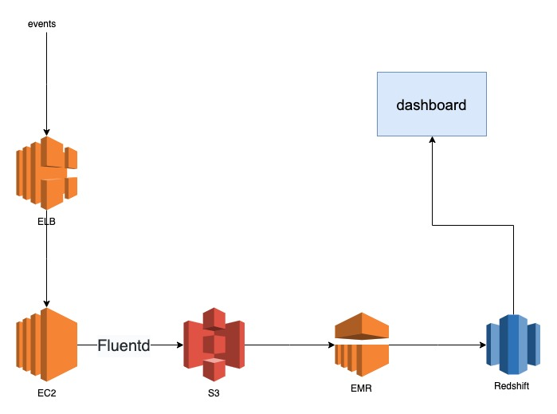

# Design Question

- http events is sent to the load balancer.
- The server stores user access logs on its hard disk, and fluentd sends it to S3.
- EMR aggregates S3 log and inserts the results into Redshift.
  - If there is a bug in the processing, it can be reaggregate with EMR.
- Customers can see the metrics stored in Redshift from the dashboard.

